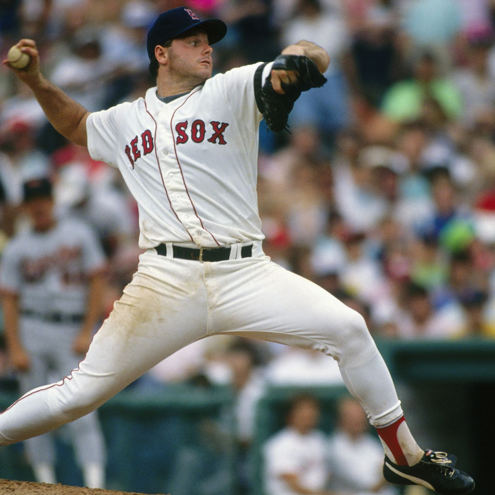
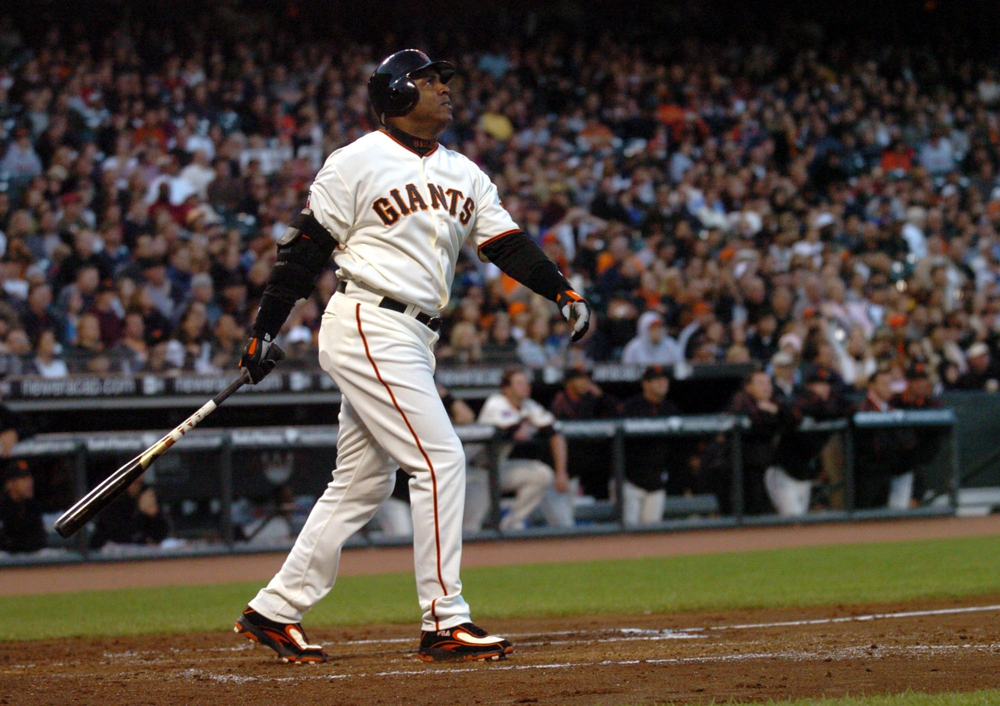
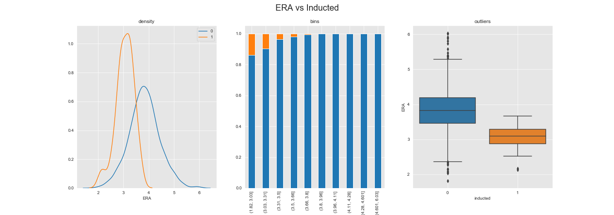
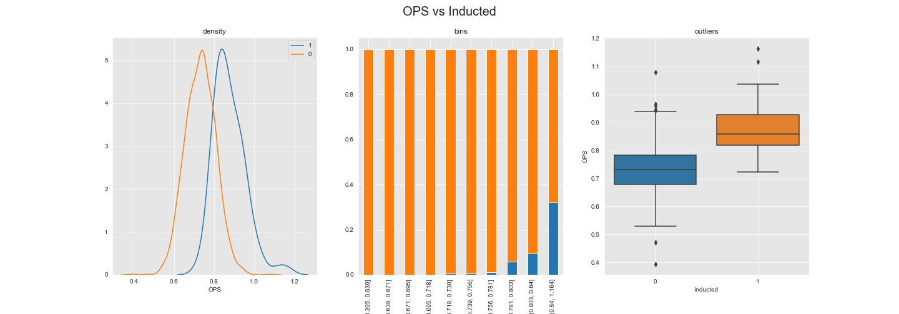
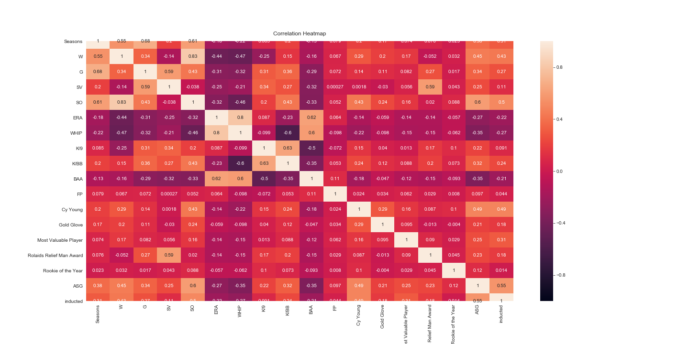
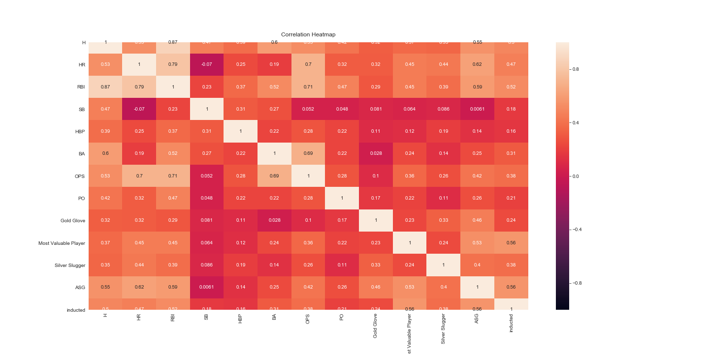
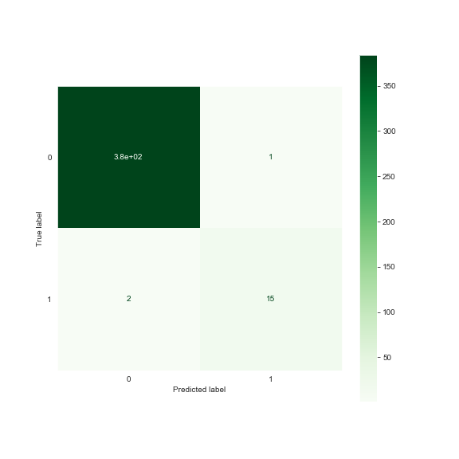
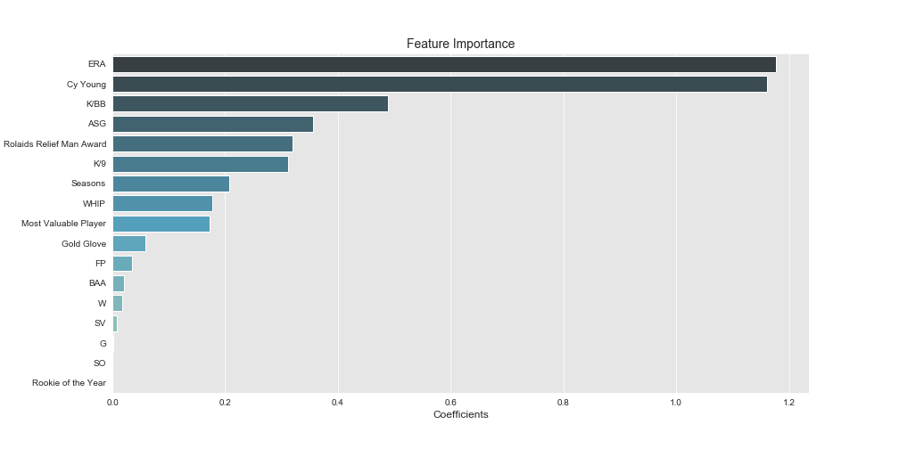
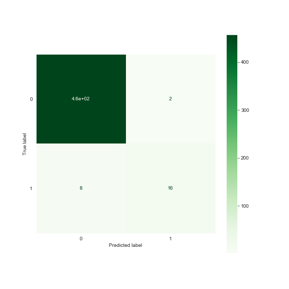

# Major League Baseball Hall of Fame Analysis

## Contributing Member:

Derek Davis

## Project Overview

There is no better sound in sports than the crack of the bat or pop of the mitt, but there is much more to gather from a day at the ballpark than just these simple pleasures. Major League Baseball is flooded with statistics and analytics, every team is fighting for a competitive advantage through modified fielding position, enhanced swing paths and basic managerial decisions. However, the question we are going to answer today is going to take us through all Eras of baseball from the Dead Ball Era to the Expansion and Steriod Eras and beyond. The question I will answer today is: What are the major considerations a member of the Baseball Writers of America should take into account when voting for future Hall of Famers?

## Data Exploration and Cleaning

My first step was to import, explore, clean and combine all necessary datasets. All tables were provided by and downloaded from http://www.seanlahman.com/baseball-archive/statistics/. The following is a list of all tables used in this analysis.

### Batting
Contains all hitting statistics for every player broken down by sesaon.

### Pitching
Contains all pitching statistics for every player broken down by sesaon.

### Fielding
Contains all fielding statistics for every player broken down by sesaon.

### All-Stars
Contains the All-Star selections dating back to the inception of the game in 1933.

### Awards
Only top awards for on field performance were considered for this model.

### Hall of Fame
List of all players who have been elected into the Hall of Fame, will be the target variable.

## Initial Considerations:

The two individuals pictured here, Roger Clemens and Barry Bonds, could be argued as the best pitcher and hitter of all time. Roger Clemens has won more Cy Young awards than any other player over the course of his career and Barry Bonds famously broke Hank Aaron's longstanding career home run record at the end of his career. Typically these two achievements would be more than enough to be consider first ballot Hall of Famers; however, due to suspected steroid use they find themselves on the outside looking in. For that reason I am going to remove those individuals who have not been elected due to non-performance related issues such as Performance Enhancing Drugs and scandals detrimental to the sport to avoid misleading outliers.

## Exploratory Analysis

After removing these outliers I took a look at some of the key statistics and visually compared how both sets of players differed. The two that I initially thought would be the most telling are ERA for pitchers and OPS for batters.

After exploring some of the features I created a heat map to determine which were highly correlated and could lead to multicollinearity issues in the model.

Now that I have explored and prepped the data, it was time to test a few models to determine which best worked for this analysis.

## Model Results

For both models, the Support Vector Machine ended up producing the best results. After tuning the intial pitching model with GridSearchCV it produced a highly accurate result of 99.25% for both training and testing accuracy. These results were very good, but slightly misleading as there would be been 97% accuracy if all pitchers were classified as non-inductees. A look at the below confusion matrix shows that only 3 pitchers were misclassified

I also created a table showing the top features of this model, which visualizes what the BBWA emphasize when they are considering a player for induction.

The hitting model, which also used SVM, found the best results after the features were scaled using StandardScalar. Although this model also had a high degree of testing accuracy at just under 98%, it was only able to correctly classify 67% of the Hall of Famers correctly. As visualized below, there was a slight issue with the recall score of this model and would be an area to consider in the future work of this analysis.

Below is also the top features of the batting model. Although most are what I would have initially predicted, OPS was a lot lower in importance than i had anticipated.

## Recommendations

When considering who should be inducted in the Major League Baseball Hall of Fame, I would recommend the following:

1. When analyzing the past performances in order to make a decision on future inductees, remove those individuals who have not been elected due to non-performance related issues such as Performance Enhancing Drugs and scandals detrimental to the sport.
2. When reviewing a player, some of the key areas to focus on should be MVP, Silver Slugger, Gold Glove and All-Star game appearances. There are several others but when analyzing what has had the most impact on voting in the past, those features were most predominant.
3. Take into consideration which is more important, that there are no individuals who deserve to be in the Hall of Fame left out, that no one who doesn't deserve be let in or perhaps a combination of both. It is my recommendation that neither is more important than the other.
4. It is important when considering a player for induction that not too much emphasis be placed on two sets of statistics that are highly correlated, otherwise it'll give additional the value to each.
5. Although fielding is an important part of the game, most of the value of a Hall of Famer comes from the pitching or hitting statistics and to stay consistent with past voting should carry most of the weight.

## Future Work

There are several other considerations that I would like to make in the future.

1. Consider all Hall of Fame inductees, not just those voted in by the Baseball Writers of America.
2. Further analyze how position impacts the Hall of Fame voting, for instance a catcher should be compared to other catchers rather than all position players.
3. Which players who have currently played at least ten seasons and have not yet been eligible for HOF voting are likely to be elected based on the analysis.
4. Incorporate the era that an individual played into the model. The game and the individual statistics have changed so much over the last 100 years that it's reasonable to assuem this is having an impact on the model.